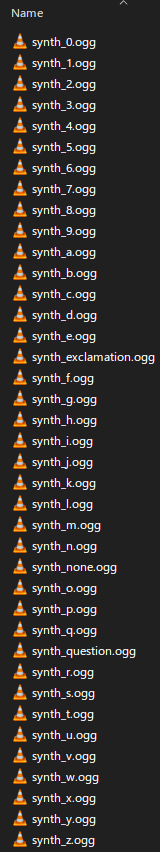

# mc-textbox-generator

Create animated textboxes for vanilla minecraft using this command line tool.
Outputs a data pack and resource pack.

## Requirements

Bash (Unix shell) version 4+
ImageMagick version imagemagick-6.q16

A standard bash shell installation found in a modern linux distribution will also include anything else required by this script.

If you are running Microsoft Windows, use Windows Subsystem for Linux version 1+ to run this script.

## What is included?

The most recent release of this tool includes:

`maketb.sh` An executable shell script.
`.fonts/mc.otf` The minecraft standard font is included for convenience.
`boxart.png` A standard textbox graphic based on the vanilla minecraft resources.
`speaker0.png` and `speaker1.png` Two frames of Oatmeal the popcat are provided as a sample speaker.

## How to use (Standard textboxes)

Download the most recent release of this tool and extract the contents of the archive INTO your .minecraft folder.
Run the shell script. If bash complains make sure it is marked as executable by running `chmod +x ./maketb.sh` in the .minecraft folder.
Follow the instructions in the shell script.
When asked for a speaker image, you can just type `speaker0.png` and `speaker1.png` for the closed and open mouth images.
You can replace those files in .minecraft and the script will use those instead. They can be any size in pixels, the script resizes them for you.
When asked for a textbox graphic image, you can just type `boxart.png` for the default. Otherwise you must provide a 512x114 image. The script will not resize it if the size is wrong and the output in game might be horrifying otherwise.
The output will go directly into your Minecraft installation.
Run Minecraft and enable the resource pack and data pack.
To show your textbox, call the function with `/function <namespace>:<functionname>`

## Method of operation

The textboxes are shown by exploiting Minecraft's font engine. Minecraft displays each on-screen character by looking up an image file (usually 8x8 pixels) and drawing on the screen. However, resource packs allow for other fonts to be used in the game. By creating a new font with different image files, arbitrary images can be shown on screen instead. This script creates image files at a much larger size of 256x114 containing textbox graphics and displays them one at a time in rapid succession, creating an animation on the player's screen.

The in-game functions to achieve this can get very long and complicated with long textboxes. They would be extremely tedious to write manually and so this script exists to automate the process.
Additionally, creating the textbox graphics manually is potentially even more tedious without good animation tools. This script takes care of most of that too.

The script takes inputs from the user to determine the text to show on screen, the images to compose the textbox out of, and small details such as transitions, specific unicode regions to use, and namespaces.
The script then processes these inputs to instruct ImageMagick, a command-line image manipulation tool, to render the graphics frame-by-frame and format them such that Minecraft will accept them as unicode characters.
The script also creates the necessary JSON, MCFUNCTION and MCMETA files for the resource pack and data pack to be interpreted.

## How to use (Advanced)

If you understand the bash shell language, you can probably customise your textboxes with more freedom easily.
Parameters that are simple to change inside the script are:
    Choosing another font
    Moving the speaker animation to another location on the textbox
    Resizing the speaker
    Changing the name of sounds

## Loosely implemented features
# Sounds
The script offers some support for sounds. The idea is that a short sound can be played for every character displayed in the text box in a style similar to that used in games such as Undertale and Animal Crossing.
At present the script assigns hard-coded names for the sounds the play. The names of the sounds correspond to the specific text character. The table below shows the sound files in `resourcepacks/<packname>/assets/<namespace>/sounds/voices`

If you places sounds in this location, the textbox will use them in game if you also have a correct `sounds.json` file in the resource pack. A working example file can be found in this repository.
If you don't, because these sound commands are hard-coded, the console will throw errors. This might have a performance impact on your text boxes.
I don't plan on implementing this properly because it's a pain and I really made this for me but wanted to also make it public. If you implement it properly feel free to distribute that version because that sounds very good.
